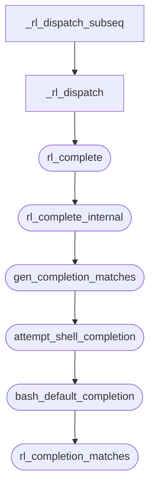

## TAB补全的原理
在如`bash`或`zsh`这样的shell中,命令行补全功能是由一些库实现的,`bash`是`readline`,`zsh`是`zle`.

`readline`里的补全依靠是`rl_complete`这个函数,`rl_complete`调用`rl_complete_internal`,`rl_complete_internal又要调用其他函数。


![[Pasted image 20240922211630.png]]

- `gen_completion_matches`来生成补全项
- `attempt_shell_completion`尝试执行shell特定的补全逻辑
- `bash_default_completion`是bash默认的补全逻辑
- `rl_completion_matches`调用生成器函数生成匹配项
``` c
  while (string = (*entry_function) (text, matches))
    {
      if (RL_SIG_RECEIVED ())
	{
	  /* Start at 1 because we don't set matches[0] in this function.
	     Only free the list members if we're building match list from
	     rl_filename_completion_function, since we know that doesn't
	     free the strings it returns. */
	  if (entry_function == rl_filename_completion_function)
	    {
	      for (i = 1; match_list[i]; i++)
		xfree (match_list[i]);
	    }
	  xfree (match_list);
	  match_list = 0;
	  match_list_size = 0;
	  matches = 0;
	  RL_CHECK_SIGNALS ();
	}

      if (matches + 1 >= match_list_size)
	match_list = (char **)xrealloc
	  (match_list, ((match_list_size += 10) + 1) * sizeof (char *));

      if (match_list == 0)
	return (match_list);

      match_list[++matches] = string;
      match_list[matches + 1] = (char *)NULL;
    }
```
## TAB补全的简单实现
TAB补全简单来说就是读入TAB，处理，调用补全函数，可以自己做一个简单的实现。
GPT有一个不错的实现
``` c
#include <stdio.h>
#include <stdlib.h>
#include <string.h>
#include <unistd.h>
#include <termios.h>
#include <sys/wait.h>

#define MAX_CMD_LEN 256
#define MAX_CMDS 10

// 一些示例命令用于补全
const char *commands[] = {
    "ls", "cat", "echo", "exit", "touch", "mkdir", "rm", "pwd", "clear", "help"
};

// 禁用行缓冲
void disable_line_buffering() {
    struct termios t;
    tcgetattr(STDIN_FILENO, &t);
    t.c_lflag &= ~ICANON;  // 禁用缓冲
    t.c_lflag &= ~ECHO;    // 禁用回显
    tcsetattr(STDIN_FILENO, TCSANOW, &t);
}

// 启用行缓冲
void enable_line_buffering() {
    struct termios t;
    tcgetattr(STDIN_FILENO, &t);
    t.c_lflag |= ICANON;   // 启用缓冲
    t.c_lflag |= ECHO;     // 启用回显
    tcsetattr(STDIN_FILENO, TCSANOW, &t);
}

// 打印 shell 提示符
void print_prompt() {
    printf("mini-shell> ");
    fflush(stdout);
}

// 匹配用户输入的命令前缀
const char *autocomplete(const char *input) {
    for (int i = 0; i < MAX_CMDS; i++) {
        if (strncmp(input, commands[i], strlen(input)) == 0) {
            return commands[i];
        }
    }
    return NULL;
}

// 执行用户输入的命令
void execute_command(char *cmd) {
    char *args[MAX_CMD_LEN / 2 + 1];
    int argc = 0;

    args[argc] = strtok(cmd, " ");
    while (args[argc] != NULL) {
        argc++;
        args[argc] = strtok(NULL, " ");
    }

    if (strcmp(args[0], "exit") == 0) {
        exit(0);
    }

    pid_t pid = fork();
    if (pid == 0) {
        // 子进程执行命令
        if (execvp(args[0], args) == -1) {
            perror("mini-shell");
        }
        exit(EXIT_FAILURE);
    } else if (pid < 0) {
        perror("mini-shell");
    } else {
        // 父进程等待子进程结束
        wait(NULL);
    }
}

int main() {
    char cmd[MAX_CMD_LEN];
    char ch;
    int pos = 0;

    // 禁用行缓冲模式以便立即捕获按键
    disable_line_buffering();

    while (1) {
        print_prompt();

        // 逐个读取字符
        while (1) {
            ch = getchar();

            if (ch == '\n') {
                cmd[pos] = '\0';  // 命令结束
                break;
            } else if (ch == 9) {  // Tab 键
                cmd[pos] = '\0';   // 临时终止输入的字符串
                const char *completion = autocomplete(cmd);
                if (completion) {
                    // 补全命令
                    strcpy(cmd, completion);
                    pos = strlen(cmd);
                    printf("\rmini-shell> %s", cmd);  // 更新输入
                    fflush(stdout);
                }
            } else if (ch == 127) {  // 处理退格键
                if (pos > 0) {
                    pos--;
                    printf("\b \b");  // 删除字符
                }
            } else {
                cmd[pos++] = ch;  // 存储用户输入的字符
                putchar(ch);      // 显示字符
            }
        }

        // 如果输入为空，跳过执行
        if (pos == 0) {
            continue;
        }

        // 执行命令
        cmd[pos] = '\0';
        execute_command(cmd);

        // 重置命令输入
        pos = 0;
    }

    // 恢复行缓冲模式
    enable_line_buffering();

    return 0;
}

```

## GPT log[[shell的TAB补全原理]]
- Q:找到shell源代码中，负责命令行补齐的源代码
- Q:gen_completion_matches,attempt_shell_completion,bash_default_completion,rl_completion_matches
- 写一个tab补全的小shell

