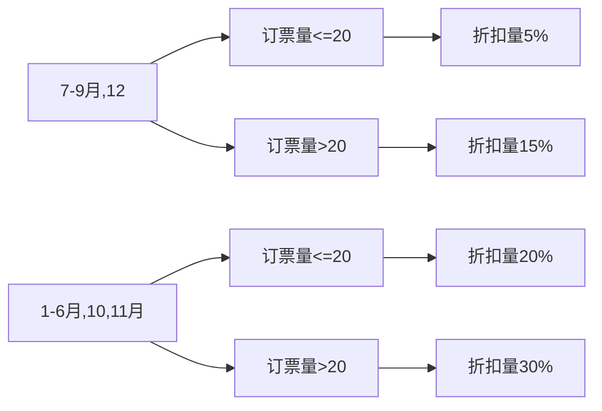
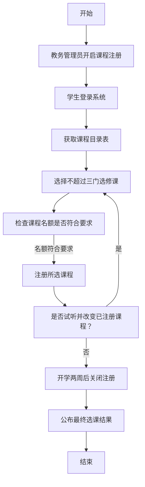
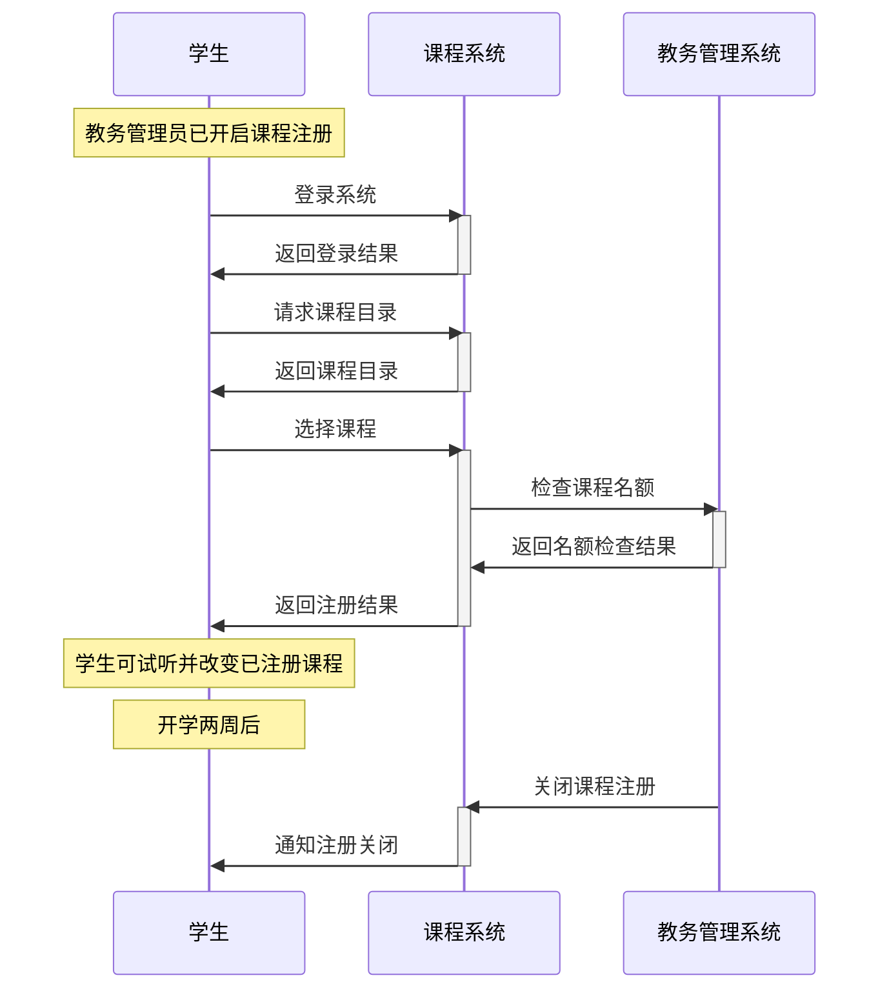
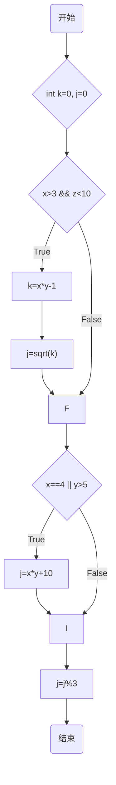

## p51
### 二、1

虽然分析、设计和实现是软件开发过程中至关重要的技术环节，但一个完善的开发过程同样不可或缺。一个良好的开发过程能对项目进行有效管理和控制，合理安排进度、分配资源、把控质量等。
### 二、3

RUP的核心理念是迭代与增量开发。XP即极限编程，是一种轻量化的敏捷开发框架，核心理念是客户参与，测试驱动。
二者是对立统一的。表面看起来两者似乎有些对立，但实际上两者是相辅相成、相互补充来解决软件开发的两个层面的问题。RUP面向管理层面，XP面向实施层面。XP完成每个增量，有关项目的资源规划、进度计划、基线与里程碑、指标度量、阶段控制等管理是必须要做的，确定和调整这些管理内容有意无意地遵循着RUP模型。在RUP管理框架之下，才能在迭代实施过程中采用XP,发挥XP的"快速"作用。
## p69
### 二、2
问题定义、可行性研究和项目计划有着很大的作用。问题定义有助于避免因对需求理解不准确而导致的开发偏差。可行性研究主要对项目的经济、技术、操作和进度等方面进行分析和评估，以确定项目是否值得投资和开发。可以合理分配人力、物力和财力资源。项目计划是项目的路线图，详细规划了项目的各个阶段、任务、时间安排和责任人。通过项目计划，可以对项目进度进行有效监控。张先生的做法是不正确的。
## P106
### 二

| 条件组合 | 旅游时间 | 7-9月,12 | 7-9月,12 | 1-6月,10,11月 | 1-6月,10,11月 |
| ---- | ---- | ------- | ------- | ----------- | ----------- |
|      | 订票量  | <=20    | >20     | <=20        | >20         |
| 折扣量  | 5%   | √       |         |             |             |
| 折扣量  | 15%  |         | √       |             |             |
| 折扣量  | 20%  |         |         | √           |             |
| 折扣量  | 30%  |         |         |             | √           |

## 三、1

将“客观世界”直接映射到“计算机世界”往往是不可行的，原因在于"客观世界“的复杂性，大型复杂问题所需的可管理性。开发起点是客观世界（客观世界）。这是软件要解决的现实问题或要实现的功能需求所在的领域。在这个阶段，我们使用**自然语言**进行需求获取和初步描述。开发终点是计算机世界（计算机世界）。这是软件最终运行的环境，由计算机硬件和软件组成。在这个阶段，我们使用计算机语言（编程语言）编写出能够被计算机执行的代码。自然语言在需求获取阶段使用，用于描述用户的需求和期望。建模语言（建模语言）：在软件设计阶段使用。计算机语言（计算机语言）：在软件实现阶段（编码）使用，是能够被计算机直接或间接执行的形式化语言（例如Java, Python, C++ 等）。
## P117
### 二、1
- 数据对象描述、E-R 图和数据字典 这些描述数据及其关系的部分直接映射到数据设计。
- 数据流图和加工说明 这些描述数据如何流动和被处理的部分主要映射到过程设计，同时也可能影响接口设计，因为数据需要在不同的模块或系统之间传递。
- 状态迁移图和控制规约,这些描述系统行为和控制逻辑的部分主要映射到系统结构设计和接口设计，因为它们决定了系统的组成部分以及它们如何交互和控制。
从DFD到SC是数据流图转换为系统结构设计

## p198
### 二1-5
#### 1

![[Pasted image 20250520003144.png]]

#### 2

在教务管理员开启“课程注册”后，学生经登录进入“课程注册”用例来完成选课。进入后首先获得该学期的课程目录表，课程目录表中列出了每门课程的所有信息，诸如课程名、学时、学分、基本信息、开课教师、开课院系和选课条件等。每个学生可以从开课列表中选择不超过三门的选修课，每门课程最多不能超过 30 人，最少不能低于 5 人，低于 5 人的课程将被取消。在选课期间允许学生试听并改变已注册课程，开学两周后教务管理员关闭“课程注册”。一旦学生的注册过程关闭，形成最终的选课结果并予以公布。

| 步骤  | 操作描述                                   |
| --- | -------------------------------------- |
| 1   | 教务管理员开启“课程注册”。                         |
| 2   | 学生登录系统。                                |
| 3   | 学生获取课程目录表。                             |
| 4   | 学生从课程目录中选择不超过三门的选修课。                   |
| 5   | 系统检查每门课程的选课人数是否符合要求（不超过 30 人，不少于 5 人）。 |
| 6   | 学生注册所选课程。                              |
| 7   | 在选课期间，学生可以试听并改变已注册课程。                  |
| 8   | 开学两周后，教务管理员关闭“课程注册”。                   |
| 9   | 形成最终的选课结果并予以公布。                        |
|     |                                        |

#### 3
视图类
- **LoginView**：提供用户登录界面，接收用户名和密码输入。
- **StudentView**：展示学生可执行的操作界面，如查询课程、注册课程、查询成绩等。
- **AdminView**：展示教务管理员可执行的操作界面，如维护信息、开启/关闭课程注册等。
- **TeacherView**：展示教师可执行的操作界面，如查询课程和学生信息、登记成绩等。
逻辑类
- **UserManager**：管理用户登录验证，确保只有合法用户可以访问系统。
- **CourseManager**：处理与课程相关的逻辑，包括课程查询、注册、退课等操作。
- **RegistrationManager**：管理课程注册的开启和关闭，处理学生的选课请求，确保选课符合规定。
- **GradeManager**：处理成绩的登记和查询逻辑。
实体类
- **User**：表示系统用户，包含用户名、密码、用户类型（学生、教师、管理员）等属性。
- **Student**：继承自 User，包含学号、姓名、已选课程列表等属性。
- **Teacher**：继承自 User，包含工号、姓名、所授课程列表等属性。
- **Admin**：继承自 User，包含工号、姓名、管理权限等属性。
- **Course**：表示课程，包含课程号、课程名、学时、学分、教师、选课条件、选课人数等属性。
- **Grade**：表示学生成绩，包含学号、课程号、成绩值等属性。
#### 4

#### 5
- **User** (UserID, Username, Password, UserType)
- **Student** (StudentID, Grade, Major)
- **Teacher** (TeacherID, Title, Department)
- **Course** (CourseID, CourseName, Hours, Credits, Department, Prerequisites, MaxEnrollment, MinEnrollment)
- **Enrollment** (StudentID, CourseID, Grade)
- **Admin** (AdminID, ManagedDepartment)

## p230
### 二、1
(1)

(2)

| 测试用例 | x   | y   | z   | 语句覆盖情况           |
| ---- | --- | --- | --- | ---------------- |
| 1    | 5   | 6   | 5   | 执行语句块1和语句块2和语句块3 |
| 2    | 4   | 3   | 15  | 执行语句块3           |

| 测试用例 | x | y | z  | 分支覆盖情况      |
| ---- | - | - | -- | ----------- |
| 1    | 5 | 6 | 5  | 条件1为真，条件2为真 |
| 2    | 2 | 3 | 15 | 条件1为假，条件2为假 |
| 3    | 4 | 3 | 5  | 条件1为假，条件2为真 |
| 4    | 5 | 3 | 15 | 条件1为真，条件2为假 |
### 二、2
1. 开始 → 初始化 → 条件1 → 语句块1 → 条件2 → 语句块2 → 语句块3 → 结束
2. 开始 → 初始化 → 条件1 → 条件2 → 语句块3 → 结束
3. 开始 → 初始化 → 条件1 → 语句块1 → 条件2 → 语句块3 → 结束
4. 开始 → 初始化 → 条件1 → 条件2 → 语句块2 → 语句块3 → 结束

|测试用例|x|y|z|路径|
|:--|:--|:--|:--|:--|
|1|5|6|5|路径1|
|2|4|3|15|路径2|
|3|5|3|5|路径3|
|4|2|6|15|路径4|
### 二、4

| 等价类    | 描述                    | 测试用例            | 预期结果 |
| ------ | --------------------- | --------------- | ---- |
| 有效等价类1 | 合法用户名，长度8-12位，包含字母和数字 | "User123"       | 通过   |
| 无效等价类1 | 长度小于8位                | "User1"         | 不通过  |
| 无效等价类2 | 长度大于12位               | "User123456789" | 不通过  |
| 无效等价类3 | 仅有字母                  | "Username"      | 不通过  |
| 无效等价类4 | 仅有数字                  | "12345678"      | 不通过  |
| 无效等价类5 | 包含非法字符                | "User\@123"     | 不通过  |

| 测试用例 | 用户名                   | 预期结果 |
| ---- | --------------------- | ---- |
| 1    | "A1234567" (8位)       | 通过   |
| 2    | "A12345678901" (12位)  | 通过   |
| 3    | "A123456789012" (13位) | 不通过  |
| 4    | "A12345678" (7位)      | 不通过  |

## p247
### 1
软件维护是在软件交付使用之后，为了改正错误或满足新的需求而修改软件的过程。软件维护分为纠错性维护、适应性维护、改善性维护以及预防性维护。