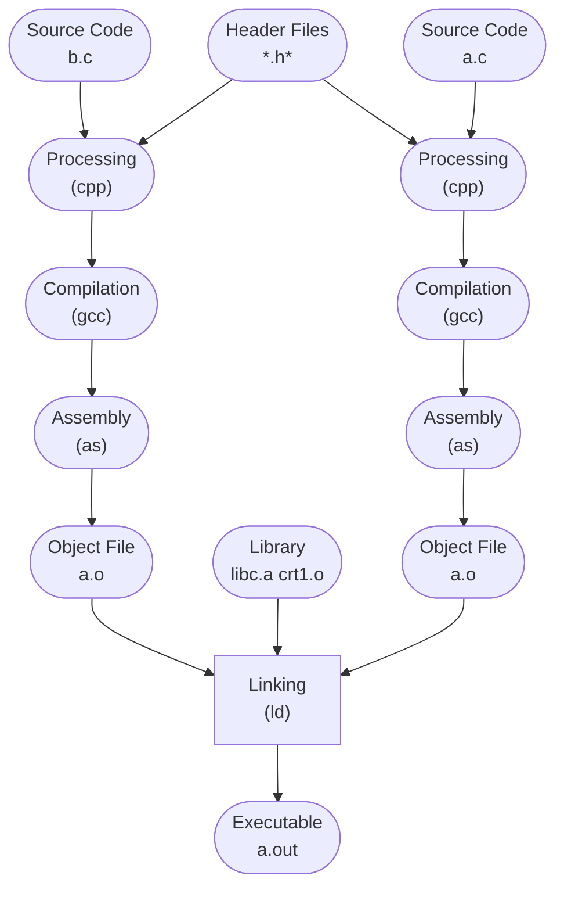

## 步骤
``` shell
$ gcc hello.c
$./a.out
```


## 预编译
``` shell
$gcc -E hello.c -o hello.i
$cpp hello.c > hello.i
```

>主要用来处理“#” 开头的预编译指令

- 将所有的“#define”删除，并且展开所有的宏定义。
- 处理所有条件预编译指令，如“#if”等。
- 处理“#include”预编译指令，递归插入包含的文件。
- 删除注释。
- 添加行号和文件名标识，以便于调试和产生警告信息。
- 保留所有的#pragma指令供编译器使用。

## 编译
>编译即对预处理文件进行一系列词法分析、语法分析、语义分析及优化后生成汇编代码。
``` shell
$gcc -S hello.i -o hello.s
$gcc -S hello.c -o hello.s
```
后台调用cc1
``` shell
$ /usr/lib/gcc/x86_64-linux-gnu/11/cc1
```

```
c:cc1
c++:cc1plus
Objective-C:cc1obj;
fortran:f771;
Java:jc1
```

>gcc只是这些后台程序的包装， 它会根据不同的参数要求区调用预编译编译程序cc1、汇编器as、链接器ld。

## 汇编
``` shell 
$as hello.s -o hello.o
$gcc -c hello.s -o hello.o
```

## 链接


## 编译过程


``` cpp
array[index] = (index + 4) *(2 + 6)
CompilerExpression.c
```
## 词法分析
扫描器(*scanner*)运用类似于有限状态机(*Finite State Machine*)的算法可以将源代码的字符分割成一系列的记号(*Token*)；
例:

|  记号   |  类型  |
| :---: | :--: |
| array |      |
|  \[   | 左方括号 |
| index | 标识符  |
|   ]   | 右方括号 |
|   =   |  赋值  |
|   (   | 左圆括号 |
| index | 标识符  |
|   +   |  加号  |
|   4   |  数字  |
|   )   | 右圆括号 |
|  \*   |  乘号  |
|   (   | 左圆括号 |
|   2   |  数字  |
|   +   |  加号  |
|   6   |  数字  |
|   )   | 右圆括号 |
>记号分类 
- 关键字
- 标识符
- 字面量(数字，字符串)
- 特殊符号(加号、等号)

>有一个叫lex的程序可以实现词法扫描。

>一些有预处理语言，宏替换和文件包含等工作交给一个独立的预处理器。
## 语法分析
由**语法分析器(Grammar Parser)** 将对由扫描器产生的记号进行语法分析，从而将产生**语法树(Syntax Tree)**。整个分析过程采用了**上下文无关语法(Context-free Grammer)**。语法分析器生成的语法树就是以**表达式(Expression)** 为节点的树。

>语法分析有一个现成的工具叫做yacc(Yet Another Compiler Compiler)。

## 语义分析
语义分析由**语义分析器(Semantic Analyzer)** 来完成。**静态语义(Static Semantic)** 在编译期可以被确定，**动态语义(Dynamic Semantic)** 在运行期才能确定。
- 静态语义通常包括声明和类型的匹配，类型的转换。如一个浮点型的表达式赋值给一个整型的表达式。
- 动态语义指在运行期出现的语义相关的问题。


## 中间语言生成

>现代编译器有着很多层次的优化

语法树会转换成 **中间代码(Intermediate Code)**。中间代码有很多种表示形式，如**三地址码(Three-address Code)** 与 **P-代码(P-Code)**。
三地址码即一个语句里面有三个变量地址。
即$x = y\quad\mathbf{op}\quad z$ 

>中间代码使得编译器可以被分成前端和后端。前端负责产生机器无关的中间代码，后端将中间代码转换成目标机器代码。

## 目标代码生成与优化
编译器后端主要包括**代码生成器(Code Generator)** 和**目标代码优化器(Target Code Optimize)**。代码生成器将中间代码转换成目标机器代码。目标代码优化器再对目标代码进行优化。
如：
``` assembly
movl index, %ecx
addl $4, %ecx
mull $8, %ecx
movl index, %eax
```

``` assembly
movl index, %edx
leal 32(,%edx, 8), %eax
movl %eax, array(, %edx, 4)
```

## 链接器
随着软件规模的膨大，代码量越来越多，人们考虑将代码按照功能和性质，划分为不同的模块。这就需要考虑通过**链接**组合这些模块，产生一个可执行程序。

## 静态链接
链接过程主要包括了**地址和空间分配(Address and Storage) 、符号决议(Symbol Resolution)、重定位(Relocation)** 等步骤。


比如在main.c文件里使用另一个模块fun.c的函数foo。链接器会根据foo符号，自动去fun.c模块查找foo的地址，然后修正main.c引用到符号foo的指令。修改其目标地址。
>假如编译器不知道一个变量的目标地址，会先置零。链接后，目标地址被修正。这个过程也可以称之为**重定位(Relocation)**,每个要被修正的地方叫一个**重定位入口(Relocation Entry)**。
## 目标文件的格式
- 目标文件即是源代码编译后单位进行链接的那些文件。
- 目标文件与可执行文件的格式几乎一样。
>现在PC平台上流行的可执行文件 **(Executable)** 有*Windows*下的`PE` **(Portable Executable)** 和*Linux*下的`ELF`**(Executable Linkable Format)**。它们都是`COFF`**(Common file format)** 的变种。

|ELF文件类型|说明|实例|
|-|-|-|
|可重定位文件(Relocatable File)|包含代码和数据，可以被链接成可执行文件或共享目标文件，静态链接库也可归为这一类|Linux的`*.o`|
|可执行文件(Executable File)|这类文件包含了可以直接执行的程序，代表有ELF可执行文件|bin/bash文件Windows下的`*.exe`|
|共享目标文件|包含代码和数据，可以在以下两种情况下使用，一种是链接器可以使用这种文件跟其他的可重定位文件和共享目标文件链接，产生新的目标文件。第二种是动态链接器可以将几个这种共享目标文件与可执行文件结合，作为进程映像的一部分|Linux的`*.so*`，Windows下的DLL|
|核心转储文件(Core Dump File)|当进程意外终止时，系统将进程有关信息转储到核心转储文件|Linux下的`core dump`|

``` shell
luoyue@LAPTOP-5SNFF2BT:~/test/complation_test$ file /bin/bash
/bin/bash: ELF 64-bit LSB pie executable, x86-64, version 1 (SYSV), dynamically linked, interpreter /lib64/ld-linux-x86-64.so.2, BuildID[sha1]=33a5554034feb2af38e8c75872058883b2988bc5, for GNU/Linux 3.2.0, stripped

luoyue@LAPTOP-5SNFF2BT:~/test/complation_test$ file hello.o
hello.o: ELF 64-bit LSB relocatable, x86-64, version 1 (SYSV), not stripped

luoyue@LAPTOP-5SNFF2BT:~/test/complation_test$ file /lib/gcc/x86_64-linux-gnu/11/liblto_plugin.so
/lib/gcc/x86_64-linux-gnu/11/liblto_plugin.so: ELF 64-bit LSB shared object, x86-64, version 1 (SYSV), dynamically linked, BuildID[sha1]=0067ae6d56486eff0a8652a7079918ba667cebce, stripped
```
## 浅观目标文件
`ELF`文件的开头是一个“文件头”，描述了整个文件的文件属性。文件头有一个**段表(Section Table)**。 
段表里面可以得到各个段的信息。文件头后面就是各个段的内容。代码段保存指令，数据段保存程序的数据。
如c语言编译成的机器代码，保存在.text段。已初始化的全局变量和局部静态变量保存在.bss中。**.bss段只是为未初始化的全局变量和静态变量预留位置而已**，不占实际空间，因为.bss段本身就为0，不需要保存在磁盘中，可以在程序执行时再申请内存。
程序源代码被编译以后主要分成两种段：
- 程序指令(.text)
- 程序数据(.bss)
数据和指令分段的好处
1. 数据和指令分别被映射到两个虚存区域。可以分别设置两个区域的权限。使其可读写和只读。防止程序指令被改写。
2. 现代CPU有着极为强大的缓存(Cache)体系。指令区和数据区的分离有利于提高程序局部性。提高缓存命中率。
3. 当程序中运行着多个该程序的副本时，指令是一样的，内存中只须要保存一份改程序的指令部分。
## 挖掘目标文件
``` c
/*
Linux:
	gcc -c SimpleSection.c
Windows:
	cl SimpleSection.c /c /Za(MSVC下的)
	其实Windows也可以自己装gcc
*/
int printf(const char* format, ...);

int global_init_var = 84;
int global_uninit_var;

void func1(int i)
{
	printf("%d\n", i);
}

int main(void)
{
	static int static_var = 85;
	static int static_var2;

	int a = 1;
	int b;

	func1(static_var + static_var2 + a + b);
	return a;
}
```

``` shell
$ gcc -c SimpleSection.c
```

``` shell
$ objdump -h SimpleSection.o
```

``` shell
$ size SimpleSection.o
```

```
text    data     bss     dec     hex filename
    177       8       8     193      c1 SimpleSection.o
```

可以使用objdump 来查看目标文件
## 代码段
``` shell
objdump -s -d SimpleSection.o
```

```
SimpleSection.o:     file format elf64-x86-64

Contents of section .text:
 0000 554889e5 4883ec10 897dfc8b 45fc89c6  UH..H....}..E...
 0010 bf000000 00b80000 0000e800 00000090  ................
 0020 c9c35548 89e54883 ec10c745 fc010000  ..UH..H....E....
 0030 008b1500 0000008b 05000000 0001c28b  ................
 0040 45fc01c2 8b45f801 d089c7e8 00000000  E....E..........
 0050 8b45fcc9 c3                          .E...
Contents of section .data:
 0000 54000000 55000000                    T...U...
Contents of section .rodata:
 0000 25640a00                             %d..
Contents of section .comment:
 0000 00474343 3a202847 4e552920 31332e32  .GCC: (GNU) 13.2
 0010 2e3000                               .0.
Contents of section .eh_frame:
 0000 14000000 00000000 017a5200 01781001  .........zR..x..
 0010 1b0c0708 90010000 1c000000 1c000000  ................
 0020 00000000 22000000 00410e10 8602430d  ...."....A....C.
 0030 065d0c07 08000000 1c000000 3c000000  .]..........<...
 0040 00000000 33000000 00410e10 8602430d  ....3....A....C.
 0050 066e0c07 08000000                    .n......

Disassembly of section .text:

0000000000000000 <func1>:
   0:   55                      push   %rbp
   1:   48 89 e5                mov    %rsp,%rbp
   4:   48 83 ec 10             sub    $0x10,%rsp
   8:   89 7d fc                mov    %edi,-0x4(%rbp)
   b:   8b 45 fc                mov    -0x4(%rbp),%eax
   e:   89 c6                   mov    %eax,%esi
  10:   bf 00 00 00 00          mov    $0x0,%edi
  15:   b8 00 00 00 00          mov    $0x0,%eax
  1a:   e8 00 00 00 00          call   1f <func1+0x1f>
  1f:   90                      nop
  20:   c9                      leave
  21:   c3                      ret

0000000000000022 <main>:
  22:   55                      push   %rbp
  23:   48 89 e5                mov    %rsp,%rbp
  26:   48 83 ec 10             sub    $0x10,%rsp
  2a:   c7 45 fc 01 00 00 00    movl   $0x1,-0x4(%rbp)
  31:   8b 15 00 00 00 00       mov    0x0(%rip),%edx        # 37 <main+0x15>
  37:   8b 05 00 00 00 00       mov    0x0(%rip),%eax        # 3d <main+0x1b>
  3d:   01 c2                   add    %eax,%edx
  3f:   8b 45 fc                mov    -0x4(%rbp),%eax
  42:   01 c2                   add    %eax,%edx
  44:   8b 45 f8                mov    -0x8(%rbp),%eax
  47:   01 d0                   add    %edx,%eax
  49:   89 c7                   mov    %eax,%edi
  4b:   e8 00 00 00 00          call   50 <main+0x2e>
  50:   8b 45 fc                mov    -0x4(%rbp),%eax
  53:   c9                      leave
  54:   c3                      ret
```

`Contents of section .text`:以十六进制的方式将程序里的代码段表示出来。最左面一列是偏移量，中间4列是十六进制内容，最右面一列是.text段的ASCII码形式。

## 数据段和只读数据段
`.data`:保存已经**初始化了的全局静态变量和局部静态变量**
`.rodata`:只读数据，一般是字符串常量和只读变量(如`const`关键字修饰的变量)。这能保证程序安全性，也能适用于一些只读存储器。
>有些编译器也会把字符常量放在`.data`段。``

`.xdata`:在`Windows`下出现的，好像存储了输入参数或其他输入数据。
`.pdata`:在`Windows`下出现的，好像存储了函数参数信息等程序数据。
*(这两个资料不全无法找到)*
## BSS段
`.bss`:存放的是**未初始化的全局变量和局部静态变量**。
>有些编译器会将全局的未初始化变量存放在目标文件.bss段，有些则不存放，而是只是预留一个未定义的全局变量符号。

编译单元内部可见的静态变量(如`static tyep var`)的确是存放在`.bss`段的。

>编译器也会做很多优化，如
>`static int x = 0`可能会被放在`.bss`段中
## 其他段
|**常用段名**|**说明**|
|-|-|
|.rodata1|存放的是只读数据，比如字符串常量，全局const变量。|
|.comment|编译器版本信息|
|.debug|调试信息|
|.dynamic|动态链接信息|
|.hash|符号哈希表|
|.line|调试时的行号表，即源代码与编译后指令的对应表|
|.note|额外的编译器信息|
|.strtab|String Table.字符串表，用于存储ELF文件中用到的各种字符串|
|.symtab|Symbol Table.|符号表|
|.shstrtab|Section String Table.段名表|
|.plt<br>.got|动态链接的跳转表和全局入口表|
|.init<br>.fini|程序初始化与终结代码段|
>应用程序也可以使用一些非系统保留的名字作为段名。比如"music"表示插入音乐。但不能使用“.”作为前缀。一个ELF文件也可以拥有几个相同段名的段。

>*可以使用objcopy工具将图片，MP3音乐作为目标文件中的一个段。*

### 自定义段
*GCC*提供了一个扩展机制，使得程序员可以指定变量所处的段:
``` c
__attribute__((section("name")))
```
如
``` c
__attribute__((section("FOO"))) int global = 42;
```

## ELF文件结构描述
|ELF Header|
|-|
|.text|
|.data|
|.bss|
|...<br>other sections|
|Section header table|
|String Tables<br>Symbol Tables|
最前部是**ELF文件头**，它包含了描述整个文件的基本属性，比如ELF文件版本，目标机器型号。紧接着是各个段。与段有关的重要结构是**段表(Section Header Table)。
###  文件头

可以使用readelf来详细查看ELF文件。ELF的文件头中定义了**ELF魔数、文件机器字节长度、数据存储方式、版本、运行平台、ABI版本、ELF重定位类型、硬件平台、硬件平台版本、入口地址、程序头入口和长度、段表的位置和长度及段的数量**。
"elf.h"使用typedef定义了一套自己的变量体系。
``` c
/* Type for a 16-bit quantity.  */
typedef uint16_t Elf32_Half;
typedef uint16_t Elf64_Half;

/* Types for signed and unsigned 32-bit quantities.  */
typedef uint32_t Elf32_Word;
typedef int32_t  Elf32_Sword;
typedef uint32_t Elf64_Word;
typedef int32_t  Elf64_Sword;

/* Types for signed and unsigned 64-bit quantities.  */
typedef uint64_t Elf32_Xword;
typedef int64_t  Elf32_Sxword;
typedef uint64_t Elf64_Xword;
typedef int64_t  Elf64_Sxword;

/* Type of addresses.  */
typedef uint32_t Elf32_Addr;
typedef uint64_t Elf64_Addr;

/* Type of file offsets.  */
typedef uint32_t Elf32_Off;
typedef uint64_t Elf64_Off;

/* Type for section indices, which are 16-bit quantities.  */
typedef uint16_t Elf32_Section;
typedef uint16_t Elf64_Section;
```
ELF文件头结构体
``` c
typedef struct
{
  unsigned char e_ident[EI_NIDENT];     /* Magic number and other info */
  Elf32_Half    e_type;                 /* Object file type */
  Elf32_Half    e_machine;              /* Architecture */
  Elf32_Word    e_version;              /* Object file version */
  Elf32_Addr    e_entry;                /* Entry point virtual address */
  Elf32_Off     e_phoff;                /* Program header table file offset */
  Elf32_Off     e_shoff;                /* Section header table file offset */
  Elf32_Word    e_flags;                /* Processor-specific flags */
  Elf32_Half    e_ehsize;               /* ELF header size in bytes */
  Elf32_Half    e_phentsize;            /* Program header table entry size */
  Elf32_Half    e_phnum;                /* Program header table entry count */
  Elf32_Half    e_shentsize;            /* Section header table entry size */
  Elf32_Half    e_shnum;                /* Section header table entry count */
  Elf32_Half    e_shstrndx;             /* Section header string table index */
} Elf32_Ehdr;

typedef struct
{
  unsigned char e_ident[EI_NIDENT];     /* Magic number and other info */
  Elf64_Half    e_type;                 /* Object file type */
  Elf64_Half    e_machine;              /* Architecture */
  Elf64_Word    e_version;              /* Object file version */
  Elf64_Addr    e_entry;                /* Entry point virtual address */
  Elf64_Off     e_phoff;                /* Program header table file offset */
  Elf64_Off     e_shoff;                /* Section header table file offset */
  Elf64_Word    e_flags;                /* Processor-specific flags */
  Elf64_Half    e_ehsize;               /* ELF header size in bytes */
  Elf64_Half    e_phentsize;            /* Program header table entry size */
  Elf64_Half    e_phnum;                /* Program header table entry count */
  Elf64_Half    e_shentsize;            /* Section header table entry size */
  Elf64_Half    e_shnum;                /* Section header table entry count */
  Elf64_Half    e_shstrndx;             /* Section header string table index */
} Elf64_Ehdr;
```

`readelf`生成的信息
``` shell
luoyue@LAPTOP-5SNFF2BT:~/test/complation_test$ readelf SimpleSection.o -h
ELF Header:
  Magic:   7f 45 4c 46 02 01 01 00 00 00 00 00 00 00 00 00
  Class:                             ELF64
  Data:                              2's complement, little endian
  Version:                           1 (current)
  OS/ABI:                            UNIX - System V
  ABI Version:                       0
  Type:                              REL (Relocatable file)
  Machine:                           Advanced Micro Devices X86-64
  Version:                           0x1
  Entry point address:               0x0
  Start of program headers:          0 (bytes into file)
  Start of section headers:          952 (bytes into file)
  Flags:                             0x0
  Size of this header:               64 (bytes)
  Size of program headers:           0 (bytes)
  Number of program headers:         0
  Size of section headers:           64 (bytes)
  Number of section headers:         13
  Section header string table index: 12
```

|成员|readelf输出结果与含义|
|-|-|
|e_ident|Magic:<br>Class:<br>Data:<br>Version:<br>OS/ABI:<br>ABI Version:
|e_type|Type:<br>ELF文件类型|
|e_machine|Machine:<br>ELF文件的CPU平台属性，相关常量以EM开头|
|e_version|Version:<br>ELF版本号|
|e_entry|Entry point address:<br>入口地址，规定ELF程序的入口虚拟地址，OS在加载完该程序后从这个地址开始执行进程的指令，可重定位文件一般没有入口地址|
|e_phoff|Start of program headers:|
|e_shoff|Start of program headers:<br>段表在文件中的偏移|
|e_word|Flags:<br>ELF标志位，用来表示一些ELF文件平台相关的属性。|
|e_ehsize|ELF文件头本身的大小|
|e_phentsize|Size of program headers:|
|e_phnum|Number of program headers:|
|e_shentsize|Size of section headers:<br>段表描述符的大小|
|e_shnum|Number of section headers:<br>段表描述符数量|
|e_shstrndx|Section header string table index:<br>段表字符串所在的段在段表中的下标|
**ELF魔数**:
>*Magic*的16个字节刚好对应"Elf32_Ehdr"的e_ident这个成员。最开始的四个字节是所有ELF文件都必须相同的标识码，分别为0x7f，0x45，0x4c，0x46。
>0x7f:文件中的DEL控制符，
>0x45:E
>0x4c:L
>0x46:F
>这四个字节又被称为ELF魔数。魔数用来确认文件的类型，操作系统在加载可执行文件时会确认魔数是否正确。

>第五个字节用来标识ELF的文件类，0x01表示32位，0x02表示64位。
>第六个字节是字节序，规定该文件是小端还是大端。
>第七个字节规定ELF文件的主版本号，一般是1。ELF标准自1.2以后就没变过
>后面9个字节ELF没有定义,通常为0，有些平台会使用这9个字节作拓展标志。

**文件类型**:
>e_type表示ELF文件类型，每个文件类型对应一个常量，系统通过这个常量来判断ELF的真正文件夹，而不是扩展名。以“ET_"开头

``` cpp
#define ET_NONE         0               /* No file type */
#define ET_REL          1               /* Relocatable file */
#define ET_EXEC         2               /* Executable file */
#define ET_DYN          3               /* Shared object file */
#define ET_CORE         4               /* Core file */
#define ET_NUM          5               /* Number of defined types */
#define ET_LOOS         0xfe00          /* OS-specific range start */
#define ET_HIOS         0xfeff          /* OS-specific range end */
#define ET_LOPROC       0xff00          /* Processor-specific range start */
#define ET_HIPROC       0xffff          /* Processor-specific range end */
```
**机器类型**:
>不同平台下的ELF文件都遵循同一套ELF文件标准。但同一个ELF文件不可以在不同的平台使用。e_machine成员表示该ELF文件的平台属性。以”EM_"开头，tips:elf.h下看到了250多个值

``` cpp
#define EM_NONE          0      /* No machine */
#define EM_M32           1      /* AT&T WE 32100 */
#define EM_SPARC         2      /* SUN SPARC */
#define EM_386           3      /* Intel 80386 */
#define EM_68K           4      /* Motorola m68k family */
#define EM_88K           5      /* Motorola m88k family */
#define EM_IAMCU         6      /* Intel MCU */
#define EM_860           7      /* Intel 80860 */
#define EM_MIPS          8      /* MIPS R3000 big-endian */
#define EM_S370          9      /* IBM System/370 */
#define EM_MIPS_RS3_LE  10      /* MIPS R3000 little-endian */
```
## 段表
**段表(Section Header Table)** 描述了ELF各个段的信息，比如每个段的段名、长度、偏移、读写权限。编译器、链接器、装载器都是依靠段表来定位和访问各个段的属性的。段表位置由”e_shoff"决定。
>使用`objdump -h`只会把关键段显示出来可以使用`readelf`工具来查看ELF文件的段。

```
Section Headers:
  [Nr] Name              Type             Address           Offset
       Size              EntSize          Flags  Link  Info  Align
  [ 0]                   NULL             0000000000000000  00000000
       0000000000000000  0000000000000000           0     0     0
  [ 1] .text             PROGBITS         0000000000000000  00000040
       0000000000000055  0000000000000000  AX       0     0     1
  [ 2] .rela.text        RELA             0000000000000000  000002a8
       0000000000000078  0000000000000018   I      10     1     8
  [ 3] .data             PROGBITS         0000000000000000  00000098
       0000000000000008  0000000000000000  WA       0     0     4
  [ 4] .bss              NOBITS           0000000000000000  000000a0
       0000000000000008  0000000000000000  WA       0     0     4
  [ 5] .rodata           PROGBITS         0000000000000000  000000a0
       0000000000000004  0000000000000000   A       0     0     1
  [ 6] .comment          PROGBITS         0000000000000000  000000a4
       0000000000000013  0000000000000001  MS       0     0     1
  [ 7] .note.GNU-stack   PROGBITS         0000000000000000  000000b7
       0000000000000000  0000000000000000           0     0     1
  [ 8] .eh_frame         PROGBITS         0000000000000000  000000b8
       0000000000000058  0000000000000000   A       0     0     8
  [ 9] .rela.eh_frame    RELA             0000000000000000  00000320
       0000000000000030  0000000000000018   I      10     8     8
  [10] .symtab           SYMTAB           0000000000000000  00000110
       0000000000000138  0000000000000018          11     8     8
  [11] .strtab           STRTAB           0000000000000000  00000248
       0000000000000060  0000000000000000           0     0     1
  [12] .shstrtab         STRTAB           0000000000000000  00000350
       0000000000000061  0000000000000000           0     0     1
Key to Flags:
  W (write), A (alloc), X (execute), M (merge), S (strings), I (info),
  L (link order), O (extra OS processing required), G (group), T (TLS),
  C (compressed), x (unknown), o (OS specific), E (exclude),
  D (mbind), l (large), p (processor specific)
```

>段表结构比较简单，它是一个以"ELf32_Shdr"结构体为元素的数组。"Elf32_Shdr"又被称为**段描述符**。

*ELF文件描述符结构*

``` cpp
typedef struct
{
  Elf32_Word    sh_name;                /* Section name (string tbl index) */
  Elf32_Word    sh_type;                /* Section type */
  Elf32_Word    sh_flags;               /* Section flags */
  Elf32_Addr    sh_addr;                /* Section virtual addr at execution */
  Elf32_Off     sh_offset;              /* Section file offset */
  Elf32_Word    sh_size;                /* Section size in bytes */
  Elf32_Word    sh_link;                /* Link to another section */
  Elf32_Word    sh_info;                /* Additional section information */
  Elf32_Word    sh_addralign;           /* Section alignment */
  Elf32_Word    sh_entsize;             /* Entry size if section holds table */
} Elf32_Shdr;


typedef struct
{
  Elf64_Word    sh_name;                /* Section name (string tbl index) */
  Elf64_Word    sh_type;                /* Section type */
  Elf64_Xword   sh_flags;               /* Section flags */
  Elf64_Addr    sh_addr;                /* Section virtual addr at execution */
  Elf64_Off     sh_offset;              /* Section file offset */
  Elf64_Xword   sh_size;                /* Section size in bytes */
  Elf64_Word    sh_link;                /* Link to another section */
  Elf64_Word    sh_info;                /* Additional section information */
  Elf64_Xword   sh_addralign;           /* Section alignment */
  Elf64_Xword   sh_entsize;             /* Entry size if section holds table */
} Elf64_Shdr;
```

| 属性           | 描述                                                                                                                                                                                                                                                                                                                          |
| ------------ | --------------------------------------------------------------------------------------------------------------------------------------------------------------------------------------------------------------------------------------------------------------------------------------------------------------------------- |
| sh_name      | 段名是个字符串，它位于一个叫做".shstrtab"的字符串表。sh_name是段名字符串在".shstrtab"中的偏移，对编译器来说很有意义                                                                                                                                                                                                                                                    |
| sh_type      | 段的类型，详见后文“段的类型”                                                                                                                                                                                                                                                                                                             |
| sh_flags     | 段的标志位，详见后文“段的标志位”                                                                                                                                                                                                                                                                                                           |
| sh_addr      | 段虚拟地址，如果该段可以被加载，则sh_addr为该段被加载后在进程地址空间中的虚拟地址；否则sh_addr为0                                                                                                                                                                                                                                                                    |
| sh_offset    | 段偏移，如果该段存在于文件中，则表示该段在文件中的偏移；否则无意义，比如sh_offset对于BSS段来说就没有意义                                                                                                                                                                                                                                                                  |
| sh_size      | 段的长度                                                                                                                                                                                                                                                                                                                        |
| sh_link 和    | 段链接信息                                                                                                                                                                                                                                                                                                                       |
| sh_info      | 详见后文“段的链接信息”                                                                                                                                                                                                                                                                                                                |
| sh_addralign | 段地址对齐<br>有些段对段地址对齐有要求，比如我们假设有个段刚开始的位置包含了一个double变量，因为Intel x86系统要求浮点数的存储地址必须是本身的整数倍，也就是说保存double变量的地址必须是8字节的整数倍。这样对一个段来说，它的sh_addr必须是8的整数倍。由于地址对齐的数量都是2的指数倍，sh_addralign表示是地址对齐数量中的指数，即 sh_addrlign=3表示对齐为2 的3次方倍，即8倍，依此类推。所以一个段的地址 sh_addr必须满足下面的条件，即 sh_addr %（2**sh_addralign)=0。**表示指数运算。如果sh_addralign为0或1，则表示该段没有对齐要求 |
| sh_entsize   | 项的长度，有些段包含了一些固定大小的项，比如符号表，它包含的每个符号所占的大小都是一样的。对于这种段，sh_entsize表示每个项的大小。如果为0，则表示该段不包含固定大小的项                                                                                                                                                                                                                                   |

**段的类型(sh_type)**:段的名字只在链接和编译过程中有意义，但并不能真正地表示段地类型。主要决定段的属性的是段的类型(*sh_type*)和段的标志位(*sh_flags*),相关常量以*SHT_* 开头。

| 常量           | 值   | 含义                                  |
| ------------ | --- | ----------------------------------- |
| SHT_NULL     | 0   | 无效段                                 |
| SHT_PROGBITS | 1   | 程序段、代码段、数据段都是这种类型的                  |
| SHT_SYMTAB   | 2   | 表示该段的内容为符号表                         |
| SHT_STRTAB   | 3   | 表示该段的内容为字符串表                        |
| SHT_RELA     | 4   | 重定位表。该段包含了重定位信息，具体参考“静态地址决议和重定位”这一节 |
| SHT_HASH     | 5   | 符号表的哈希表。见“符号表”这一节                   |
| SHT_DYNAMIC  | 6   | 动态链接信息。具体见“动态链接”一章                  |
| SHT_NOTE     | 7   | 提示性信息                               |
| SHT_NOBITS   | 8   | 表示该段在文件中没有内容，比如.bss段                |
| SHT_REL      | 9   | 该段包含了重定位信息，具体参考“静态地址决议和重定位”这一节      |
| SHT_SHLIB    | 10  | 保留                                  |
| SHT_DYNSYM   | 11  | 动态链接的符号表。具体见“动态链接”一章                |
*段的标志位(sh_flag)**:段的标志位表示段在进程虚拟地址空间的属性，相关常量以*SHF_* 开头**。

| 常量            | 值   | 含义                                                                          |
| ------------- | --- | --------------------------------------------------------------------------- |
| SHF_WRITE     | 1   | 表示该段在进程空间中可写                                                                |
| SHF_ALLOC     | 2   | 表示该段在进程空间中分配空间。有些包含指示或控制信息的段不需要在进程空间中被分配，它们一般不会有这个标志。像代码段、数据段和.bss段都会有这个标志位 |
| SHF_EXECINSTR | 4   | 表示该段在进程空间中可以被执行，一般指代码段                                                      |

*系统保留表的属性*

| Name      | sh_type      | sh_flag                                                         |
| --------- | ------------ | --------------------------------------------------------------- |
| .bss      | SHT_NOBITS   | SHF_ALLOC + SHF_WRITE                                           |
| .comment  | SHT_PROGBITS | none                                                            |
| .data     | SHT_PROGBITS | SHF_ALLOC + SHF_WRITE                                           |
| .datal    | SHT_PROGBITS | SHF_ALLOC + SHF_WRITE                                           |
| .debug    | SHT_PROGBITS | none                                                            |
| .dynamic  | SHT_DYNAMIC  | SHF_ALLOC + SHF_WRITE (在有些系统下.dynamic段可能是只读的, 所以没有SHF_WRITE标志位) |
| .hash     | SHT_HASH     | SHF_ALLOC                                                       |
| .line     | SHT_PROGBITS | none                                                            |
| .note     | SHT_NOTE     | none                                                            |
| .rodata   | SHT_PROGBITS | SHF_ALLOC                                                       |
| .rodatal  | SHT_PROGBITS | SHF_ALLOC                                                       |
| .shstrtab | SHT_STRTAB   | none                                                            |
| .strtab   | SHT_STRTAB   | 如果该ELF文件中有可装载的段须要用到该字符串表,那么该字符串表也将被装载到进程空间,则有SHF_ALLOC标志位       |
| .symtab   | SHT_SYMTAB   | 同字符串表                                                           |
| .text     | SHT_PROGBITS | SHF_ALLOC + SHF_EXECINSTR                                       |
**段的链接信息(sh_link、sh_info)**:只对段的类型是与链接相关的，才有意义。

| 表3-11       | 表3-11              | 表3-11             |
| ----------- | ------------------ | ----------------- |
| sh_type     | sh_link            | sh_info           |
| SHT_DYNAMIC | 该段所使用的字符串表在段表中的下标  | 0                 |
| SHT_HASH    | 该段所使用的符号表在段表中的下标   | 0                 |
| SHT_REL     | 该段所使用的相应符号表在段表中的下标 | 该重定位表所作用的段在段表中的下标 |
| SHT_RELA    | 该段所使用的相应符号表在段表中的下标 | 该重定位表所作用的段在段表中的下标 |
| SHT_SYMTAB  | 操作系统相关的            | 操作系统相关的           |
| SHT_DYNSYM  | 操作系统相关的            | 操作系统相关的           |
| other       | SHN_UNDEF          | 0                 |
### 重定位表
`.rel.text`段，其类型(*sh_type*)为**SHT_REL**，是一个**重定位表(Relocation Table)**。
链接器在处理目标文件时，须要对目标文件中某些部位重定位，即代码段和数据段中那些对绝对地址的引用的位置。 每个须要重定位的代码段或数据段，都会有一个相应的重定位表。
重定位表的sh_link表示符号表的下标，sh_info表示它作用于哪个段。
### 字符串表
ELF用到了很多字符串，字符串长度不定，很难用固定结构表示，一种常见做法是把字符串放在一个表，用表的偏移来表示字符串。

| 偏移 | +0 | +1 | +2 | +3 | +4 | +5 | +6 | +7 | +8 | +9 |
|------|-----|-----|-----|-----|-----|-----|-----|-----|-----|-----|
| +0   | \0  | h   | e   | 1   | 1   | 0   | w   | 0   | r   | 1   |
| +10  | d   | \0  | M   | y   | V   | a   | r   | i   | a   | b   |
| +20  | 1   | e   | 10  |     |     |     |     |     |     |     |

| 偏移 | 字符串         |
|------|--------------|
| 0    | 空字符串       |
| 1    | helloworld    |
| 6    | world         |
| 12   | Myvariable    |
`.strtab`:字符串表，用来保存普通的字符串，比如符号的名字。
`.shstrtab`:段表字符串表，保存段表中用到的字符串，比如段名。
## 链接的接口——符号
目标文件之间相互拼合实际上是目标之间对地址的引用，即对函数和变量的地址的引用。
在链接中，我们将函数和变量统称为**符号(Symbol)** ，函数名或变量名就是**符号名(Symbol Name)**。
每一个目标文件都有一份相应的**符号表(Symbol Table)**，表内记录了所有符号，每个定义的符号有一个对应的值，叫做**符号值(Symbol Value)**。
符号类型分类:
- 定义在本目标文件的全局符号，可以被其他目标文件引用。
- 在本目标文件中引用的全局符号，却没有定义在本目标文件，这一般叫做**外部符号(External Symbol)**
- 段名，这种符号往往由编译器产生，它的值就是该段的起始地址
- 局部符号，这类符号只在编译单元内部可见。
- 行号信息，目标文件指令与源代码的对应关系。
>全局符号是最值得关注的。因为链接过程中只关心全局符号的相互“粘合”，局部和行号

``` shell
#可以使用nm来查看,readelf,objdump也可以。
nm SimpleSection.o
```
### ELF符号表结构
``` c
typedef struct
{
  Elf32_Word    st_name;        /* Symbol name (string tbl index) */
  Elf32_Addr    st_value;       /* Symbol value */
  Elf32_Word    st_size;        /* Symbol size */
  unsigned char st_info;        /* Symbol type and binding */
  unsigned char st_other;       /* Symbol visibility */
  Elf32_Section st_shndx;       /* Section index */
} Elf32_Sym;

typedef struct
{
  Elf64_Word    st_name;        /* Symbol name (string tbl index) */
  unsigned char st_info;        /* Symbol type and binding */
  unsigned char st_other;       /* Symbol visibility */
  Elf64_Section st_shndx;       /* Section index */
  Elf64_Addr    st_value;       /* Symbol value */
  Elf64_Xword   st_size;        /* Symbol size */
} Elf64_Sym;
```

| st_name   | 符号名。这个成员包含了该符号名在字符串表中的下标（还记得字符串表吧？） |
|-----------|----------------------------------------------------------------------------|
| st_value  | 符号相对应的值。这个值跟符号有关，可能是一个绝对值，也可能是一个地址等，不同的符号，它所对应的值含义不同，见下文“符号值” |
| st_size   | 符号大小。对于包含数据的符号，这个值是该数据类型的大小。比如一个double型的符号它占用8个字节。如果该值为0，则表示该符号大小为0或未知 |
| st_info   | 符号类型和绑定信息，见下文“符号类型与绑定信息”                             |
| st_other  | 该成员目前为0，没用                                                          |
| st_shndx  | 符号所在的段，见下文“符号所在段”                                            |
**符号类型和绑定信息**:该成员低四位表示符号的类型(Symbol Type),高28位表示符号绑定信息(Symbol Binding)。

| 符号绑定信息 | 值 | 说明                                           |
|--------------|----|------------------------------------------------|
| STB_LOCAL    | 0  | 局部符号，对于目标文件的外部不可见           |
| STB_GLOBAL   | 1  | 全局符号，外部可见                             |
| STB_WEAK     | 2  | 弱引用，详见“弱符号与强符号”                   |
| STT_NOTYPE  | 0   | 未知类型符号                                                             |
| STT_OBJECT  | 1   | 该符号是个数据对象，比如变量、数组等                                                 |
| STT_FUNC    | 2   | 该符号是个函数或其他可执行代码                                                    |
| STT_SECTION | 3   | 该符号表示一个段，这种符号必须是STB_LOCAL的                                         |
| STT_FILE    | 4   | 该符号表示文件名，一般都是该目标文件所对应的源文件名，它一定是STB_LOCAL类型的，并且它的st_shndx一定是SHN_ABS |

**符号所在段(st_shndx)** :如果符号定义在本目标文件中，那么这个成员表示符号所在段在段表中的下标。

| 符号所在段特殊常量 | 值     | 说明 |
|--------------------|--------|------|
| SHN_ABS            | 0xfff1 | 表示该符号包含了一个绝对的值。比如表示文件名的符号就属于这种类型的 |
| SHN_COMMON         | 0xfff2 | 表示该符号是一个“COMMON块”类型的符号，一般来说，未初始化的全局符号定义就是这种类型的。有关“COMMON”详见“深入静态链接”之“COMMON块” |
| SHN_UNDEF          | 0      | 表示该符号未定义。这个符号表示该符号在本目标文件被引用到，但是定义在其他目标文件中 |
**符号值(st_value)** :每个符号都有一个相应的值。
- 在目标文件中，如果是符号的定义且该符号不是“COMMON"块类型的(st_shndx != SHN_COMMON)，st_value表示该符号在段中的偏移。即符号所对应的函数或变量位于由st_shndx指定的段，偏移st_value的位置。
- 在目标文件中，如果符号是”COMMON“块类型的(st_shndx == SHN_COMMON)，st_value表示该符号的对齐属性。
- 在可执行文件中，st_value表示符号的虚拟地址。

|成员|源代码|意义|
|-|-|-|
|Num|st_name|符号表数组的下标|
|Value|st_value|符号值|
|Size|st_size|符号大小|
|Type|st_info低4位|符号类型|
|Bind|st_info高28位|绑定信息|
|Vis|st_other||
|Ndx|st_shndx|该符号所属的段|
|Name|st_name|符号名称|

`readelf -a`
`objdump -x`
### 特殊符号
当使用ld链接器来链接生产可执行文件时，它会定义很多特殊符号。这些符号并没有被定义，但可以直接声明并引用。只有使用ld链接器生产最终可执行文件的时候这些符号才会存在。
-  *\_\_executable_start*, 该符号为程序起始地址，不是入口地址，是程序的最开始的地址。
- *\_\_etext或\_etext或etext*，该符号为代码段结束地址，即代码段最末尾的地址。
- *\_edata或edata*，该符号为数据段结束地址，即数据段最末尾的地址。
- *_end或end*，该符号位程序结束地址。
以上地址都是程序被装载时的虚拟地址。
这些特殊符号和ld的链接脚本有关。
``` c
#include <stdio.h>

extern char __executable_start[];
extern char etext[], _etext[], __etext[];
extern char edata[], _edata[];
extern char end[], _end[];

int main()
{
    printf("Executable Start %X\n", __executable_start);
    printf("Text End %X %X %X\n", etext, _etext, __etext);
    printf("Data End %X %X\n", edata, _edata);
    printf("Executable End %X %X\n", end, _end);

    return 0;
}
```
### 符号修饰与函数签名
为了防止名称冲突(如有一个库里头也有一个main)。有函数修饰，不同系统的函数修饰不一样。
c语言早期为加`_`,后来发生了改变
c++有着一套复杂的修饰规则，通过下面这段代码可见端倪
所有符号以`_Z`开头,对于嵌套的名字,后面紧跟`N`,然后是各个名称空间和类的名字,每个名字前是字符串长度,再以`E` 结尾。对于函数来说，参数列表紧跟`E`后面
``` c++
int func(int);
float func(float);

class C {
public:
    int func(int);
    class C2 {
    public:
        int func(int);
    };
};

namespace N {
    int func(int);
    namespace N2 {
        int func(int);
    }
}

int main() {
    func(1);
    func(1.0f);
    C c;
    c.func(1);
    C::C2 c2;
    c2.func(1);
    N::func(1);
    N::N2::func(1);
}
```

``` shell
0000000000000000 T main
                 U __stack_chk_fail
                 U _Z4funcf
                 U _Z4funci
                 U _ZN1C2C24funcEi
                 U _ZN1C4funcEi
                 U _ZN1N2N24funcEi
                 U _ZN1N4funcEi
```
gnu的c++filt可以还原符号修饰后的函数
``` shell
c++filt _ZN1N4funcEi
N::func(int)
```
c++为了和c兼容，有`extern "C"`用法
``` c++
extern "C" int func(int)

extern "C" {
	int func(int);
	int var;
}
```
可以用宏来判断
``` shell
#ifdef __cplusplus
extern "C"{
#endif

void *memset (void *, int, size_t);

#ifdef __cplusplus
}
#endif
```
## 强弱符号
可以使用`__attribute__((weak))`定义一个符号为弱符号
1. 不允许强符号被多次定义（即不同的目标文件中不能有同名的强符号）; 如果有多个强符号定义，则链接器报符号重复定义错误。
2.  如果一个符号在某个目标文件中是强符号，在其他文件中都是弱符号，那么选择强符号。

3. 如果一个符号在所有目标文件中都是弱符号，那么选择其中占用空间最大的一个。比如目标文件A定义全局变量global为int型，占4个字节；目标文件B定义global为double型，占8个字节，那么目标文件A和B链接后，符号global占8个字节（尽量不要使用多个不同类型的弱符号，否则容易导致很难发现的程序错误)。

可以使用`__attribute__((weakref))`来声明弱引用，弱引用找不到，不会报错。

## 调试信息
加上`-g`后，将会出现很多debug的段,采用`DWARF`调试格式,可以使用`strip`来去掉调试信息
## 静态链接空间与地址分配
按需叠加可能导致段非常多，因为某些对齐要求，可能会非常浪费空间,所以选择相似段合并

