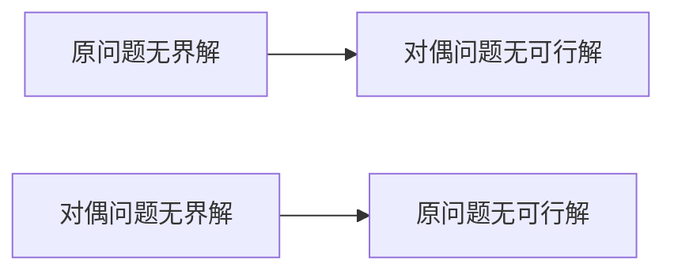
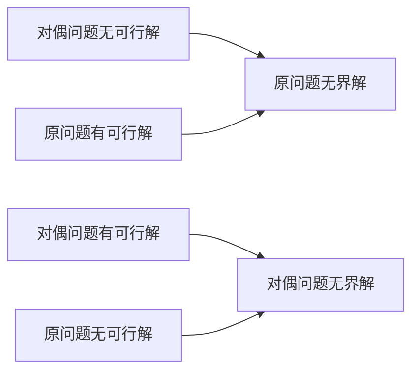

*对偶理论*

|                  | 原问题(对偶问题)                             | 对偶问题(或原问题)                                |                  |
| ---------------- | ------------------------------------- | ----------------------------------------- | ---------------- |
| 决 策 变 量 | n个; $\geq 0$; $\leq 0$; 无约束; | n个; $\geq$; $\leq$; $=$          | 线 性 约 束 |
| 线 性 约 束 | m个; $\leq$; $\geq$; $=$;     | m个; $\geq 0$; $\leq 0$; 无约束;  | 决 策 变 量 |
| 目 标           | 求max.系数是对偶 中线性约束常数                 | 求min,系数是原问题中 线性约束常数                    | 目 标           |
- 对偶问题的无界性

- 

*二阶段法*
1. 决策变量：原问题未知变量＋松弛变量＋人工变量
   目标函数：人工变量之和求最小值
   约束条件：原问题加入人工变量后的约束条件
2. 决策变量：原问题未知变量+松弛变量
   目标函数：原问题目标函数
   约束条件：将第一阶段计算得到的最终表，去除人工变量列
***
牛顿迭代法
$$
	x_{k+1} - x_{K} = f(x_{k})/f^{'}(x_{k})
$$